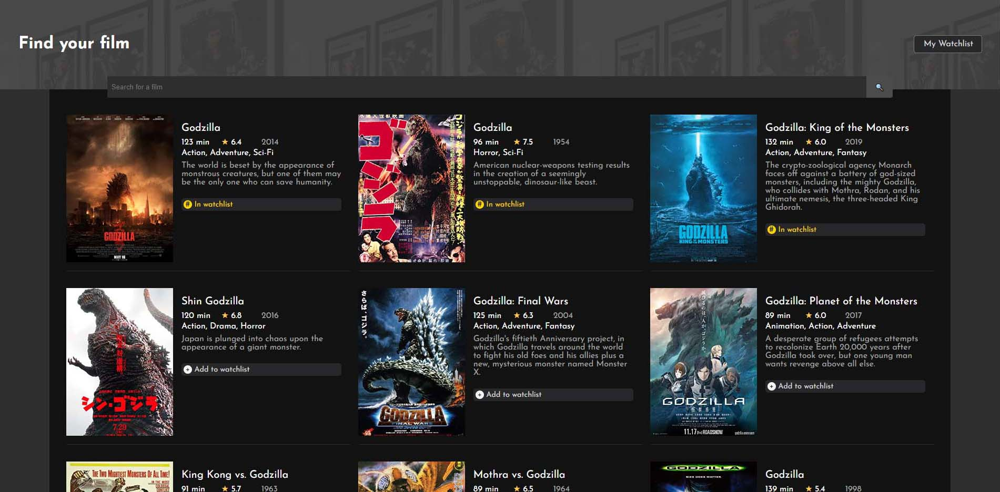

# Movies Watchlist

This is the solo project from Module 9 (Working with APIs), Part 3 (Async JavaScript) of Scrimba's [Frontend Developer Path](https://scrimba.com/learn/frontend). The project used the `fetch` API to get data from the OMDB (Open Movie Database) and allow visitors to search for films by title or keyword, get a list of results and add them to a watchlist that's saved locally in localStorage.

The project was built from scratch using a Figma file for the design and the following requirements:

- Two pages - index.html and watchlist.html
- Index = search page. Calls to OMDB API with the title searched for and displays search results.
- Button to "add to watchlist" which saves that data to local storage.
- Watchlist.html loads and displays data from local storage.

I implemented all of the functionality from the requirements and then added onto the project in the following ways:

- I used vanilla JavaScript to build a single-page application instead of having two separate pages
- Items can be removed from the watchlist
- Items added to the watchlist are highlighted as so in the search results
- Pagination was added via a "More results" button that adds 10 results at a time when clicked until all results are rendered (original version only shows a single page of results, which is up to 10)
- I made changes to the layout and added hover effects and other visual responses to orient the user when buttons are hovered and when films in the search results are already in the watchlist
    - Add to watchlist buttons turn green when hovered
    - Remove from watchlist buttons turn red when hovered
    - Items already in watchlist say so in gold and turn yellow when hovered
- Films with no images/posters render a placeholder image that says no image was available
- The application is responsive

Deployed at: https://vish213-movies.netlify.app/

## JavaScript concepts

- variables
- arrays
    - .find()
    - .forEach()
    - .indexOf()
    - .length
    - .map()
    - .push()
    - .splice()
- functions
    - async/await
    - event listeners
    - event handlers
- if/else
- return
- document
    - .getElementById()
- element
    - .addEventListener()
    - .classList
        - .add()
        - .remove()
    - .innerHTML
    - .target
        - .dataset
    - .textContent
    - .value
- localStorage
    - .getItem()
    - .setItem()
- fetch()
    - .json()
- Promise
    - .all()
- string template literals
- URL parameters
- Math
    - .ceil()
- JSON
    - .parse()
    - .stringify()